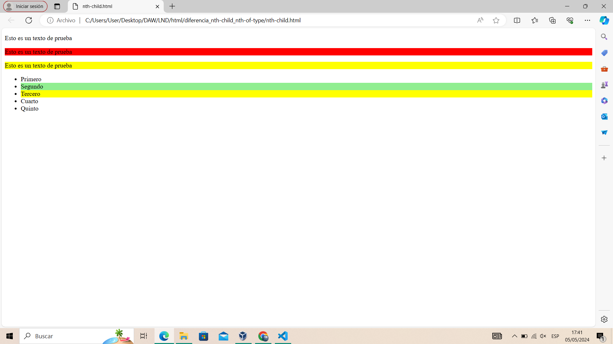
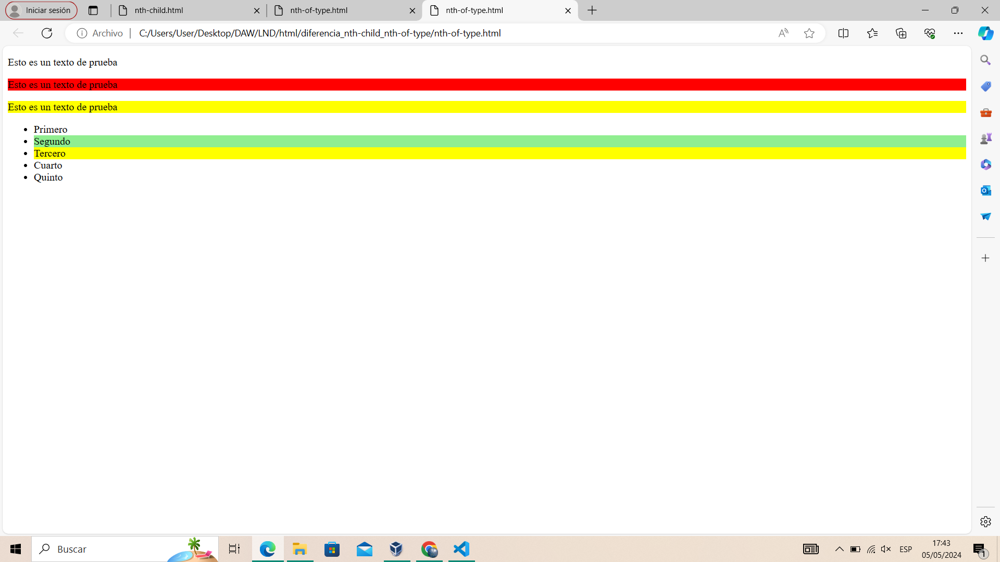

# Diferencias nth-child y nth-of-type

Las diferencias entre nth-child y nth-of-type:

- **nth-child**: Selecciona elementos según su posición general como elemento hijo. En el caso de que hagamos por ejemplo nth-child cogerá los hijos impares (hijo1, hijo3, hijo 5, etc.).
- **nth-of-type**: Selecciona elementos según su posición entre elementos del mismo tipo dentro del padre. En el caso de que hagamos por ejemplo nth-of-type cogerá los elementos del mismo tipo impares (si especificasemos para los párrafos (etiqueta p) sería el párrafo 1, 3, 5, etc.).
s
#### nth-child

#### nth-of-type

